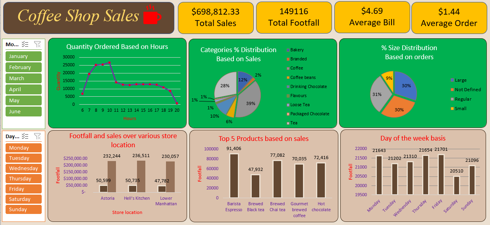

# Coffee Shop Sales Analysis

## Project Overview

This project is an MS Excel-based analysis of sales data for a coffee shop. The goal is to derive actionable insights to enhance performance and support business decisions. Using Excel, I cleaned, analyzed, and visualized the sales data to answer key business questions regarding revenue trends, customer behavior, and product performance. The analysis covers various aspects, such as sales by time, product popularity, and revenue across store locations.

## Screenshot of the Project

## Objectives

The key objectives of this analysis were:
1. Understand how sales vary by day of the week and hour of the day.
2. Identify peak times for sales activity.
3. Calculate the total sales revenue for each month.
4. Analyze sales performance across different store locations.
5. Determine the average price per order per customer.
6. Identify the best-selling products in terms of both quantity and revenue.
7. Evaluate sales by product category and type.

## Key Insights

- **Sales Patterns**: Sales activity varies significantly throughout the day, with distinct peak hours and specific days of the week that show higher sales.
- **Peak Times**: There are identifiable peak times for sales, which can help optimize staffing and inventory management.
- **Monthly Revenue Trends**: Monthly analysis reveals seasonal fluctuations in sales, providing insights into high-demand periods.
- **Store Performance**: Sales performance differs across store locations, highlighting the need to tailor marketing and product offerings based on location.
- **Product Analysis**: The best-selling products, both in terms of revenue and quantity, were identified, along with an analysis of the most popular product categories.

## Tools Used

- **Microsoft Excel**: For data cleaning, analysis, and visualization.
- **Pivot Tables and Charts**: Used for data summarization and visualization to derive insights.
- **Data Cleaning Techniques**: To prepare the dataset for accurate analysis.

## Project Features

- **Interactive Dashboard**: Created using Pivot Tables and Excel charts to help visualize key sales metrics effectively.
- **Comprehensive Analysis**: Insights into customer buying patterns, product performance, and revenue trends to drive business decisions.

## Analysis Questions Answered
1. **How do sales vary by day of the week and hour of the day?**  
   The analysis shows specific peak days and times for sales, allowing for better staffing and operational planning.

2. **Are there any peak times for sales activity?**  
   Yes, certain times of the day show significantly higher sales, indicating peak hours that require more attention.

3. **What is the total sales revenue for each month?**  
   The analysis provided detailed monthly revenue, showcasing the best-performing months.

4. **How do sales vary across different store locations?**  
   The insights show variations in sales across store locations, which can be useful for location-specific promotions.

5. **What is the average price/order per person?**  
   Calculated the average order value to understand customer spending behavior.

6. **Which products are the best-selling in terms of quantity and revenue?**  
   Identified top-selling products based on both quantity sold and revenue generated.

7. **How do sales vary by product category and type?**  
   Analyzed the performance of different product categories to understand customer preferences.

## Conclusion

This Excel-based sales analysis provides key insights that can help improve business operations, marketing efforts, and inventory management for the coffee shop. By understanding sales patterns and customer preferences, the coffee shop can optimize its product offerings and enhance customer satisfaction.

## How to Access the Analysis
The Excel file containing the analysis, along with interactive dashboards and charts, is available in this repository. Feel free to download and explore the insights derived from the sales data.

## My Education

**Education:**

1. **Bachelor of Business - Victoria University - Melbourne – Australia.    
        • Year - DECEMBER-2018 • Result – GPA 5.9/7 (Average Distinctions (73%))  
	Achieved High Distinction (HD) in 6 units, including 

        Supply Chain Analytics (Score: 90/100) ,
        Database Systems (Score: 88/100)
        Operations Management (Score: 89/100)

2. **Information Technology (IT) 2 Year Advanced Diploma  - NIIT, India**
   - Completed a 2-year program with a focus on database development and software solutions.
   - 

3. **Hospitality Management 2 Year Advanced Diploma  - Melbourne, Australia**
   - Completed a 2-year program with a focus on Hospitality and Management.
   - 
4. **Data Analytics Professional Certificate by Google**
5. **IT Support Professional Certificate by Google**
6. **Power BI Data Analytics for All Levels (CodeBasics.io)**
7. **Power BI: Complete Guide (Udemy.com)**
8. **SQL Mastery Certificate (Code with Mosh)**
9. **SQL Beginner to Advanced Certificate (CodeBasics.io)**

## Contact

Looking forward to connecting and exploring data-driven insights together!

You can also contact me via email: Prince10103030@gmail.com

Thank you for reviewing my work. I look forward to potential collaboration opportunities!

